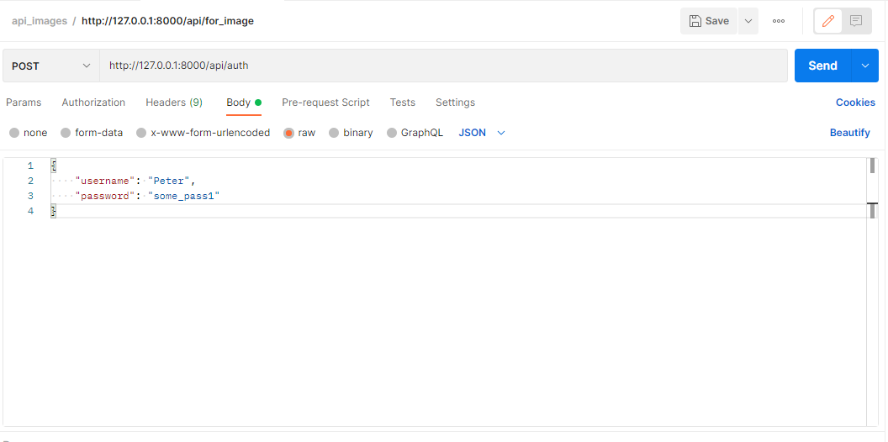
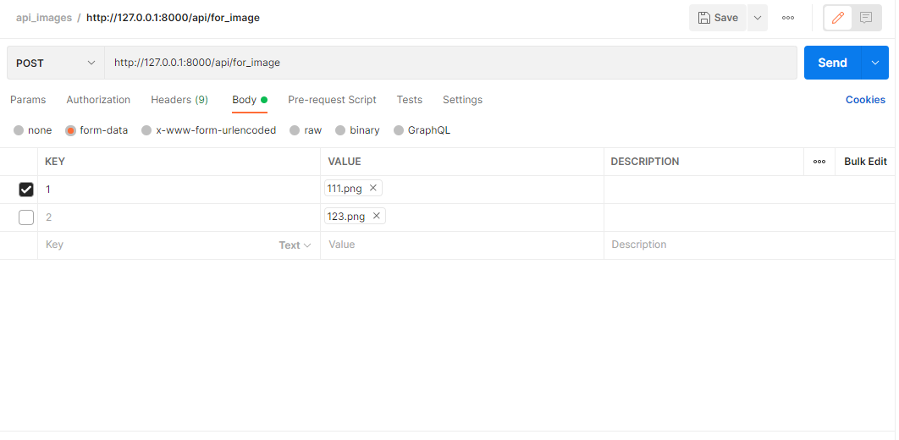

Simple http server with API functions: Authentication, Authorization, Uploading Images to the server.

Requirements:
Python3.9

Installation:
1. create venv, activate.
2. $ cd test_image_loader/
3. $ pip install -r requirements.txt
4. $ cd image_app/

Run:
$ python main_api.py

Uploaded images in folder "saved_images".

Api requests:
for example using postman:

use json with one of this pair:
{
    "username": "Peter",
    "password": "some_pass1"
}
or
{
    "username": "Vasiliy",
    "password": "some_pass2"
}

upload one or more images, but not more than 200 kbytes in total.

